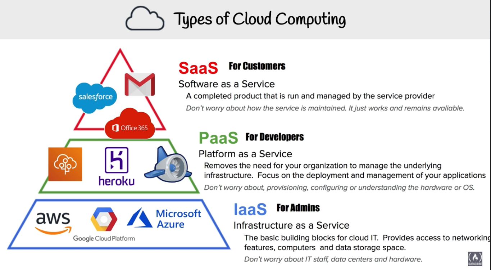

# AWS What is cloud computing?
The practice of using a network of remote servers hosted on the internet to store, manage, and process data, rather than a local server or a personal computer

##### On prem
-	You own the servers
-	You hire the IT people
-	You pay the rent on the real estate
-	You take all the risk

##### Cloud providers
-	Someone else owns the servers
-	Someody else hires the IT people
-	Someone else pays or rents the real-estate
-	You are responsible for configuring cloud services and code, Someone else takes care of the rest

### Six advantages and Benefits of cloud computing
### Why choose cloud computing over on-premise

1.	Trade capital expense for variable expense – No upfront cost, pay on demand – Instead of paying for data centres and servers pay only when you consume computing resources.

2.	Benefits from massive economies of scale – Usage from hundreds of thousands of customers aggregated in the cloud. You are sharing the cost with other customers to get unbeatable savings.

3.	Stop guessing capacity – Eliminate guesswork about infrastructure capacity needs. Instead of paying for idle or underutilized servers, you can scale up or down to meet the current need.

4.	Increase speed and agility – Launch resources within a few clicks in minutes instead of waiting days or weeks of your IT to implement the solution on premise.

5.	Stop spending money on running and maintaining data centres – Focus on your own customers, rather than on the heavy lifting of racking, stacking and powering servers.

6.	Go global in minutes – Deploy your app in multiple regions around the world with a few clicks. Provide lower latency and better experience for your customers at minimal cost.

### Types of cloud computing

#### Software as a service (SaaS) for customers
- A completed product that is run and managed by the service provider
#### Platform as a service (Paas) for developers
- Removes the need for your organization to manage the underlying infrastructure. Focus on the deployment and management of your applications
#### Infrastructure as a service (IaaS) For Admins
- The basic building blocks for cloud IT. Provides access to networking features computers and data storage space
