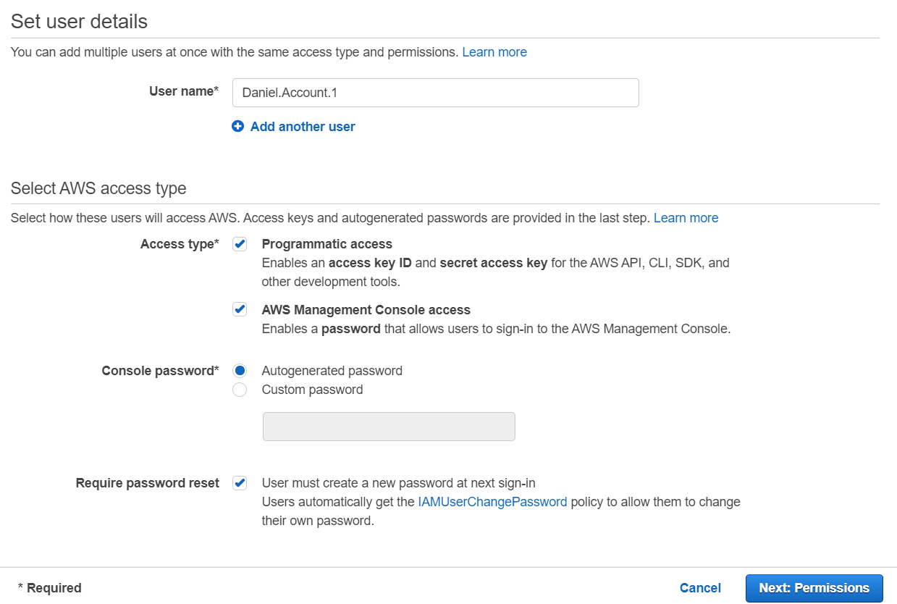

# Introduction
Domain 1: Cloud Concepts - 28%
- Define the AWS cloud
- Identify aspects of the AWS Cloud economics
- Describe different cloud architecture design principles

Domain 2: Security and Compliance - 24%
- Define AWS shared responsibility model
- Define AWS Cloud Security and compliance concepts
- Identify AWS access management capabilities
- Identify resources for security support

Domain 3: Technology - 36%
- Define method of deploying and operating IT applications in the AWS cloud
- Define AWS global infrastructure
- Identify the core AWS services
- Identify ways to contact support

Domain 4: Billing and Pricing - 12% but tricky
- Remember different pricing models for AWS
- Recognise various account structures in AWS billing and pricing
- Identify resources available for billing support

Exam Prep
- AWS Training - aws.amazon.com/training
- AWS Whitepaper - aws.amazon.com/whitepapers


# AWS What is cloud computing?
The practice of using a network of remote servers hosted on the internet to store, manage, and process data, rather than a local server or a personal computer

##### On prem
-	You own the servers
-	You hire the IT people
-	You pay the rent on the real estate
-	You take all the risk

##### Cloud providers
-	Someone else owns the servers
-	Someody else hires the IT people
-	Someone else pays or rents the real-estate
-	You are responsible for configuring cloud services and code, Someone else takes care of the rest


### Six advantages and Benefits of cloud computing
### Why choose cloud computing over on-premise

1.	Trade capital expense for variable expense – No upfront cost, pay on demand – Instead of paying for data centres and servers pay only when you consume computing resources.

2.	Benefits from massive economies of scale – Usage from hundreds of thousands of customers aggregated in the cloud. You are sharing the cost with other customers to get unbeatable savings.

3.	Stop guessing capacity – Eliminate guesswork about infrastructure capacity needs. Instead of paying for idle or underutilized servers, you can scale up or down to meet the current need.

4.	Increase speed and agility – Launch resources within a few clicks in minutes instead of waiting days or weeks of your IT to implement the solution on premise.

5.	Stop spending money on running and maintaining data centres – Focus on your own customers, rather than on the heavy lifting of racking, stacking and powering servers.

6.	Go global in minutes – Deploy your app in multiple regions around the world with a few clicks. Provide lower latency and better experience for your customers at minimal cost.


### Types of cloud computing


#### Software as a service (SaaS) for customers
- A completed product that is run and managed by the service provider
#### Platform as a service (Paas) for developers
- Removes the need for your organization to manage the underlying infrastructure. Focus on the deployment and management of your applications
#### Infrastructure as a service (IaaS) For Admins
- The basic building blocks for cloud IT. Provides access to networking features computers and data storage space

# Cloud computing deployment models


#### Cloud
-	Fully utilizing cloud computing

#### Who would use cloud?
-	Start-ups
-	SaaS offering
-	New projects and company’s

#### Hybrid
-	Use both cloud and on-premise

#### Who would use hybrid?
-	Banks
-	Fintech, investment management
-	Large professional service providers
-	Legacy on-premise 

#### On-Premise
-	Deploying resources on-premises, using virtualization and resource management tools. This is sometimes called “Private cloud”

#### Who would use on-premise (Private cloud)
-	Public sector e.g. government
-	Super Sensitive data e.g. Hospitals
-	Large enterprise with heavy regulation e.g. insurance company’s


# Regions


# Availability Zones


# Edge Locations


# Govcloud


# Identity and access management (IAM)

### Activating Multi-factor authentication (MFA)
-	This adds an extra layer of security for our AWS root account. To activate MFA I used google authenticator.

### Creating individual IAM users
- Manage users > add user > Enter information 



Then click on next to add permissions. In my case I have no groups so I will create a new group.

### Using groups to assign permissions 

Here we can add certain permissions to our new account. These could be anything dependant on the job that is required. For this demo I added full Admin access. Power user is fairly similar to Admin with a few rights removed 


#### Carry on following the prompts and your account should be succesfully created


### Apply an IAM password policy

##### This can be done by simply clicking on account settings > add password policy

##### This is the last task needed for the IAM security status to show all green ticks


##### From here on out, it is advised to used the IAM accounts generated rather than the root AWS account

### Creating a EC2 Instance
This can be done by simply clicking on Instances > Launch Instance

### Session manager
Sessions manager can be used to gain access to the Instance instead of using a SSH connection. It allow for more transpaerncy of how the servers are being used as each session is recorded
### AMI
Used to create a blueprint of a instance

```
Actions > Image > Create Image
```

### Auto scaling groups

#### It allows you to ensure that multiple instances or servers are running. Guarantees that at least one server is always running, if not a new server will automatically be created. Auto scaling groups will also determine based on certain metrics how many servers are being spun up. I.E. on football matchdays more servers may be used as the traffic will be increase. During Covid times less servers will be used as there is less traffic.

#### First we must set up a launch configuration, then we can move onto the auto scaling groups

#### To set up a auto scaling groups click on auto scaling > create auto scaling group

#### By creating both a launch configuration and auto scaling group it allows for instances to automatically be spun up whenever an instance is deemed unhealthy. For this example I used a maximum and minimum server number of 1, so every time the healthy instance becomes unhealthy a completely new server will spin up.

### Load balancer

#### Types of load balacer
- Application load balancer
- Network load balancer
- Classic load balancer

### Simple Storage Service (S3)

S3 is global and does not require a region.

An Amazon S3 bucket is a public cloud storage resource available in Amazon Web Services' (AWS) Simple Storage Service (S3), an object storage offering. Amazon S3 buckets, which are similar to file folders, store objects, which consist of data and its descriptive metadata.

### CloudFront

